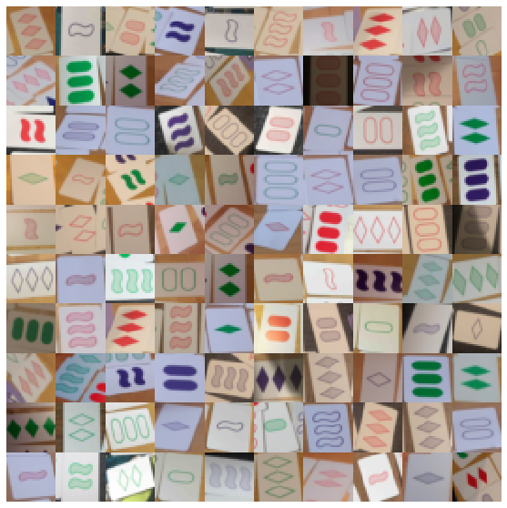
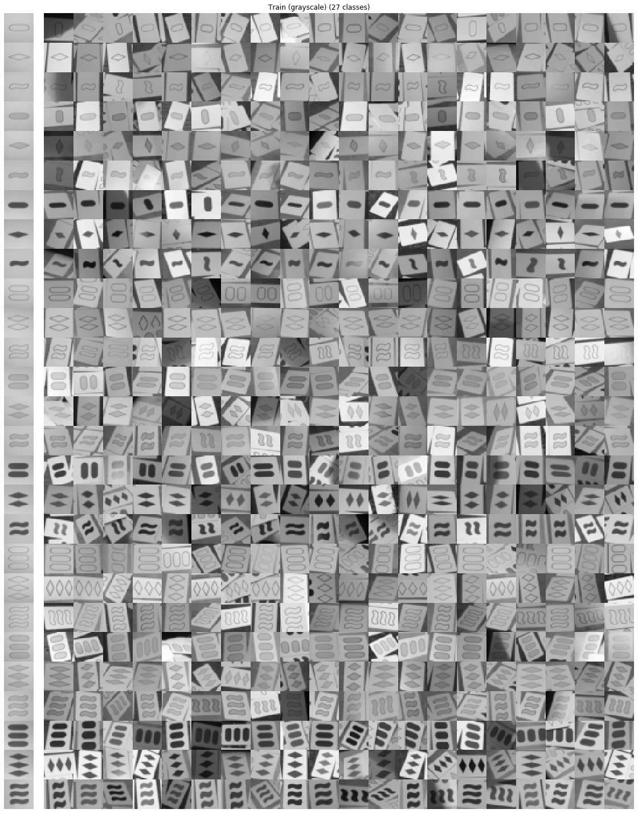
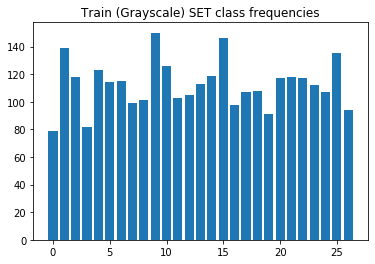

# MNISET
Small MNIST like dataset with +- 4000 28x28 RGB [SET card game](https://en.wikipedia.org/wiki/Set_(card_game)) images, with different attributes for a total of 3 * 3 * 3 * 3 = 81 classes:
* 3 different quantities: 1, 2 and 3
* 3 different fills: open, striped and solid
* 3 different colors: red, green and purple
* 3 different shapes: stadium, diamond and squiggle

Dataset gathered as a side-effect of developing the [SET Finder](https://www.set-finder.com) app.

## Color MNISET
The full color dataset has 3^4 = 81 classes and 28x28x3 (RGB) color images. See below some example images or see the [full train set](images/full_train_set.png) or [full test set](images/full_test_set.png).



### Usage
There is no need to clone this repository, simply include below snippet of code:
```python
import os
# Not that pretty but this way you just need this code
if not os.path.isfile('mniset.py'):
    from urllib import request
    request.urlretrieve('https://github.com/wouterkool/MNISET/raw/master/mniset.py', 'mniset.py')

from mniset import load_mniset, extract_dataset, extract_grayscale_dataset
mniset = load_mniset()
x_train, y_train, labels, label_imgs = extract_dataset(mniset, split='train')
x_test, y_test, *_ = extract_dataset(mniset, split='test')
```

## Grayscale MNISET
The default grayscale dataset has 3^3 = 27 classes and 28x28 grayscale images. Below you can see an example of pictures for each class (with an 'image label column' on the left):



The classes come in different frequencies:



### Usage
There is no need to clone this repository, simply include below snippet of code:
```python
import os
# Not that pretty but this way you just need this code
if not os.path.isfile('mniset.py'):
    from urllib import request
    request.urlretrieve('https://github.com/wouterkool/MNISET/raw/master/mniset.py', 'mniset.py')

from mniset import load_mniset, extract_grayscale_dataset
mniset = load_mniset()
x_train, y_train, labels, label_imgs = extract_grayscale_dataset(mniset, split='train')
x_test, y_test, *_ = extract_grayscale_dataset(mniset, split='test')
```

## Other possibilities
The dataset can also be used for 3 or 9 class classification problems, both with the color or grayscale dataset. For more details, as well as the plotting functions used here, see [mniset.ipynb](mniset.ipynb).

## DISCLAIMERS
* This dataset is under development and may change without notice. It may contain a few mistakes. Contact me if you have any questions.
* SET is a registered trademark by Cannei, LLC. This repository is not in any way affiliated.
